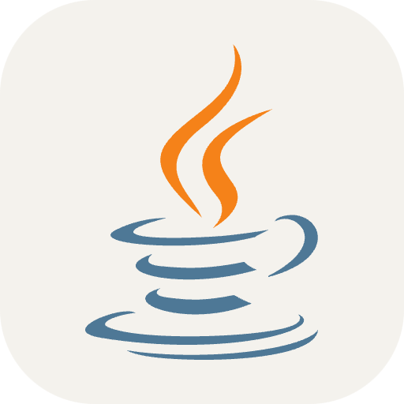
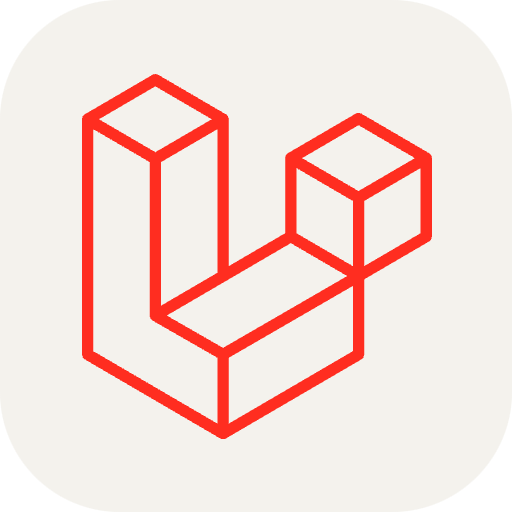
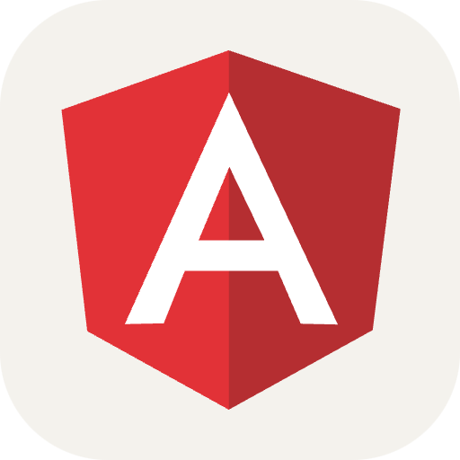
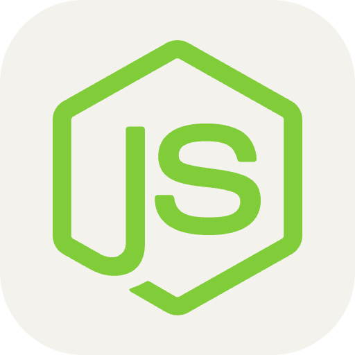
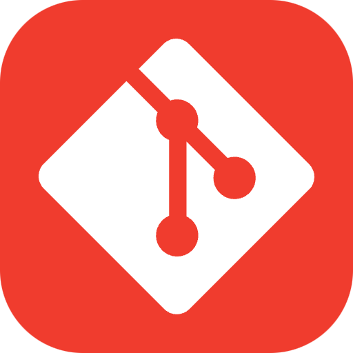
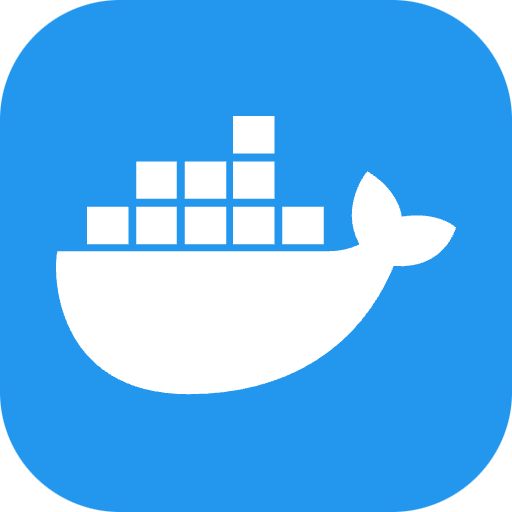
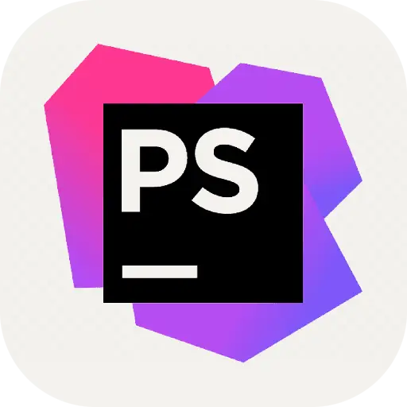

##  Hello world!

```css
#jeffersonassilva {
  display: boy;
  height: 172cm;
  position: right;
  color: lightyellow;
}
```

I'm a young Christian, INTJ personality, system developer, musician, chess player, passionate about carpentry, movies, and logical reasoning!

- 👨‍💻 &nbsp;I’m a FullStack developer | PHP & JS
- 🎓 &nbsp;Graduated in Internet Systems with a focus on web systems development
- 🌱 &nbsp;I'm currently improving my skills in Java and React Native.
- 💬 &nbsp;Ask me about anything, I'm happy to help;
- 📌 &nbsp;I live in Brasília, Brazil 🇧🇷

## How to reach me

[](https://www.linkedin.com/in/jeffersonassilva/)
[](https://www.instagram.com/jeffersonassilva/)
<a href="mailto:jeffersonassilva@gmail.com">  </a>

## My GitHub stats


## Skills and Technologies

#### Programming Languages

[](https://www.php.net/ "PHP")
[](https://www.java.com/ "Java")
[](http://www.ecmascript.org/ "JavaScript")
[](https://www.ruby-lang.org/ "Ruby")

- PHP
- Java
- JavaScript
- Ruby

#### Markup and Styling

[](https://html.spec.whatwg.org/ "HTML")
[](https://www.w3.org/Style/CSS/ "CSS")
[](https://tailwindcss.com/ "TailwindCSS")

- HTML
- CSS
- TailwindCSS

#### Frameworks and Libraries

[](https://laravel.com/ "Laravel")
[](https://codeigniter.com/ "CodeIgniter")
[](https://spring.io/ "Spring")
[](https://rubyonrails.org/ "Ruby on Rails")
[](https://react.dev/ "React")
[](https://angular.dev/ "Angular")
[](https://vuejs.org/ "Vue.js")
[](https://nodejs.org/ "Node.js")

- Laravel (PHP)
- CodeIgniter (PHP)
- Spring (Java)
- Rails (Ruby)
- React (JavaScript)
- React Native (JavaScript)
- Angular (JavaScript)
- Vue.js (JavaScript)
- Node.js (JavaScript)

#### Databases

[](https://www.mysql.com/ "MySQL")
[](https://www.postgresql.org/ "PostgreSQL")
[](https://www.microsoft.com/en-us/sql-server/sql-server-downloads "Microsoft SQL Server")
[](https://www.oracle.com/database/technologies/ "Oracle DB")

- MySQL
- PostgreSQL
- SQL Server
- Oracle DB

#### Tools and Platforms

[](https://git-scm.com/ "Git")
[](https://www.docker.com/ "Docker")
[](https://www.jetbrains.com/pt-br/phpstorm/ "PhpStorm")
[](https://code.visualstudio.com/ "Visual Studio Code")
[](https://www.jenkins.io/ "Jenkins")
[](https://www.postman.com/ "Postman")
[](https://tailwindcss.com/ "Tailwind CSS")

- Git
- Docker
- PhpStorm
- Visual Studio Code
- Jenkins
- Postman
- Tailwind CSS

#### Other Skills

- Web Development
- API Development
- Unit Testing
- Agile Methodologies
