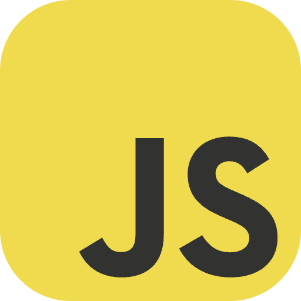

##  Hello world!

```css
#jeffersonassilva {
  display: boy;
  height: 172cm;
  position: right;
  color: lightyellow;
}
```

I'm a young Christian, INTJ personality, system developer, musician, chess player, passionate about carpentry, movies, and logical reasoning!

- 👨‍💻  I’m a FullStack developer | PHP & JS
- 📠 Graduated in Internet Systems with a focus on web systems development
- 🌱  I'm currently improving my skills in Java and React Native.
- 💬  Ask me about anything, I'm happy to help;
- 📌  I live in Brasília, Brazil 🇧🇷

## How to reach me

[](https://www.linkedin.com/in/jeffersonassilva/)
[](https://www.instagram.com/jeffersonassilva/)
<a href="mailto:jeffersonassilva@gmail.com">  </a>

## My GitHub stats


## Skills and Technologies

#### Programming Languages

[](https://www.php.net/)
[](https://www.java.com/)
[](http://www.ecmascript.org/)
[](https://www.ruby-lang.org/)

- PHP
- Java
- JavaScript
- Ruby

#### Frameworks and Libraries

[](https://laravel.com/)


- Laravel (PHP)
- CodeIgniter (PHP)
- Spring (Java)
- Rails (Ruby)
- React (JavaScript)
- React Native (JavaScript)
- Angular (JavaScript)
- Vue.js (JavaScript)
- Node.js (JavaScript)

#### Databases

[](https://www.mysql.com/)


- MySQL
- PostgreSQL
- SQL Server
- Oracle DB

#### Tools and Platforms

[](https://git-scm.com/)


- Git
- Docker
- PhpStorm
- Visual Studio Code
- Jenkins
- Postman

#### Other Skills

- Web Development
- API Development
- Unit Testing
- Agile Methodologies
